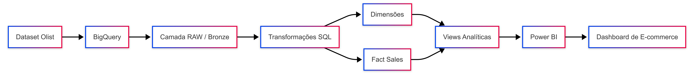
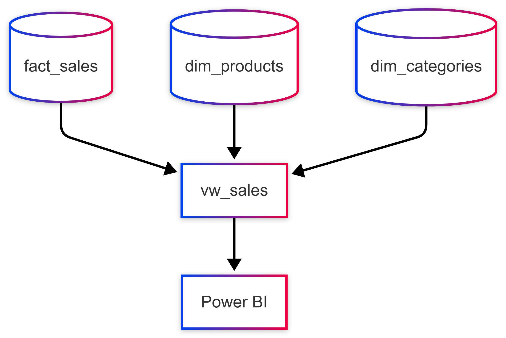

# Analytics de E-commerce --- Olist

Projeto de Engenharia de Dados desenvolvido a partir do dataset público
da **Olist**, com o objetivo de transformar dados brutos de e-commerce
em uma estrutura analítica organizada e consumível por dashboards no
**Power BI**.

O projeto aplica conceitos de **Data Warehouse, modelagem dimensional,
transformação de dados com SQL e visualização de indicadores de
negócio**.

------------------------------------------------------------------------

## Arquitetura do Projeto

O fluxo de dados foi estruturado em camadas, separando os dados brutos
da camada analítica e do consumo no Power BI.



### Fluxo

1.  Os arquivos do dataset Olist são utilizados como fonte de dados.
2.  Os dados são carregados no **Google BigQuery**.
3.  Os dados brutos são mantidos na camada **RAW/Bronze**.
4.  Consultas SQL realizam limpeza, transformação e organização dos
    dados.
5.  Os dados são estruturados em **tabelas fato e dimensões**.
6.  Views analíticas são criadas para facilitar o consumo dos dados.
7.  O **Power BI** utiliza a camada analítica para construção dos
    indicadores e dashboards.

------------------------------------------------------------------------

## Tecnologias Utilizadas

| Tecnologia | Utilização |
| :--- | :--- |
| **Google BigQuery** | Armazenamento, transformação e consulta dos dados |
| **SQL** | Limpeza, transformação e modelagem dos dados |
| **Power BI** | Visualização e análise dos indicadores |
| **Git / GitHub** | Versionamento do projeto |
| **Olist Dataset** | Fonte dos dados de e-commerce |

------------------------------------------------------------------------

## Fonte dos Dados

O projeto utiliza o dataset público de e-commerce da **Olist**, que
reúne informações relacionadas a pedidos, produtos, clientes,
vendedores, pagamentos, avaliações e localização.

Principais arquivos utilizados:

``` text
olist_orders_dataset
olist_order_items_dataset
olist_order_payments_dataset
olist_order_reviews_dataset
olist_products_dataset
olist_customers_dataset
olist_sellers_dataset
olist_geolocation_dataset
product_category_name_translation
```

------------------------------------------------------------------------

## Modelagem dos Dados

Após o carregamento dos dados brutos, as informações são organizadas em
uma estrutura dimensional para facilitar análises de vendas.

A principal tabela fato é:

``` text
fact_sales
```

Ela concentra os registros relacionados às vendas e permite a análise de
valores, pedidos, produtos, clientes e vendedores.

As informações descritivas são organizadas em tabelas de dimensão, como:

``` text
dim_products
dim_categories
```

Essa separação permite reduzir a complexidade das consultas e facilita o
consumo dos dados pelo Power BI.

------------------------------------------------------------------------

## Camadas do Data Warehouse

### RAW / Bronze

A camada RAW mantém os dados próximos ao formato original recebido da
fonte.

O objetivo dessa camada é preservar os dados de origem antes das
transformações analíticas.

``` text
RAW
├── orders
├── order_items
├── order_payments
├── order_reviews
├── products
├── customers
├── sellers
├── geolocation
└── category_translation
```

### Camada Analítica

Na camada analítica, os dados são transformados e organizados para
atender às necessidades de análise.

São aplicados processos como:

-   tratamento de dados;
-   padronização de campos;
-   relacionamento entre entidades;
-   tradução dos nomes das categorias;
-   criação de dimensões;
-   criação da tabela fato;
-   cálculo de métricas;
-   criação de views para consumo.

------------------------------------------------------------------------

## Fact Sales

A `fact_sales` representa o núcleo das análises de vendas.

Entre as informações utilizadas estão dados relacionados a:

-   pedidos;
-   itens dos pedidos;
-   produtos;
-   clientes;
-   vendedores;
-   datas;
-   status dos pedidos;
-   preço;
-   valores relacionados à venda.

A tabela fato é relacionada às dimensões para permitir análises em
diferentes perspectivas.

------------------------------------------------------------------------

## Dimensões

### `dim_products`

Armazena informações descritivas dos produtos utilizadas nas análises.

A estrutura permite relacionar os produtos aos seus respectivos
registros de vendas e categorias.

### `dim_categories`

Organiza as categorias dos produtos utilizadas na análise.

Os nomes das categorias são tratados para serem apresentados de forma
adequada no ambiente analítico e no dashboard.

------------------------------------------------------------------------

## Views Analíticas

Para facilitar o consumo dos dados, foram criadas **views no BigQuery**.

Um exemplo é:

``` text
ecommerce_views.vw_sales
```

A view consolida informações provenientes da tabela fato e das
dimensões, disponibilizando uma estrutura mais adequada para consultas
analíticas e para o Power BI.

Exemplo do fluxo:

------------------------------------------------------------------------

## Tratamento e Transformação

As transformações são realizadas utilizando SQL no BigQuery.

Entre os tratamentos aplicados estão:

-   padronização dos dados;
-   relacionamento entre tabelas;
-   tratamento de valores nulos;
-   transformação de informações para análise;
-   tradução de categorias;
-   criação de métricas;
-   organização dos dados para consumo analítico.

O objetivo é manter a camada de apresentação mais simples, deixando
parte significativa da preparação dos dados no ambiente de Data
Warehouse.

------------------------------------------------------------------------

## Power BI

O Power BI é utilizado como camada de visualização do projeto.

A partir das views e tabelas analíticas do BigQuery, são construídos
indicadores e gráficos para análise do comportamento do e-commerce.

O dashboard permite explorar informações relacionadas a:

-   vendas;
-   produtos;
-   categorias;
-   pedidos;
-   clientes;
-   desempenho comercial.

Os visuais foram estruturados para permitir análise por diferentes
dimensões e períodos.

------------------------------------------------------------------------

## Indicadores

Entre os indicadores trabalhados no projeto estão métricas relacionadas
a:

-   quantidade de pedidos;
-   quantidade de produtos vendidos;
-   valor das vendas;
-   desempenho por categoria;
-   desempenho por produto;
-   evolução das vendas;
-   distribuição das vendas por diferentes dimensões.

------------------------------------------------------------------------

## Estrutura do Projeto

A organização foi reorganizada para seguir boas práticas de projetos de dados, com separação clara por responsabilidade e facilidade de manutenção.

```text
Data Engineering Project/
├── .gitignore
├── README.md
├── requirements.txt
├── dataset.py
├── docs/
├── notebooks/
├── scripts/
├── sql/
│   ├── models/
│   └── queries/
├── src/
│   ├── __init__.py
│   ├── config.py
│   ├── etl/
│   │   ├── __init__.py
│   │   └── download_dataset.py
│   ├── pipelines/
│   │   └── __init__.py
│   └── utils/
│       ├── __init__.py
│       └── file_utils.py
├── data/
│   ├── raw/
│   ├── processed/
│   └── curated/
├── tests/
└── .venv/ (opcional, quando criado localmente)
```

### O que mudou

- `src/etl/`: concentra a lógica de extração e ingestão dos dados.
- `src/pipelines/`: reserva espaço para orquestração e pipelines de transformação.
- `src/utils/`: funções compartilhadas e utilitárias.
- `data/`: separa os dados por camada de armazenamento (`raw`, `processed`, `curated`).
- `sql/`: organiza modelos e consultas SQL de forma estruturada.
- `docs/`, `notebooks/` e `tests/`: melhoram a documentação, exploração e validação do projeto.

### Boas práticas adotadas

- modularização por responsabilidades;
- uso de diretórios específicos por camada;
- entrada centralizada em `dataset.py` para facilitar execução;
- organização do código para permitir evolução do projeto sem acoplar lógica em um único arquivo;
- preparação para futuras etapas como transformações, testes automatizados e pipelines em produção.

### Como executar

```bash
python dataset.py
```

O script realiza o download do dataset Olist usando a biblioteca `kagglehub` e salva a estrutura no diretório configurado para os dados brutos.

------------------------------------------------------------------------

A organização do projeto separa os recursos de dados, consultas e
documentação.

Uma representação simplificada é:

``` text
.
├── README.md
├── data/
│   └── datasets Olist
├── sql/
│   ├── raw/
│   ├── dimensions/
│   ├── facts/
│   └── views/
└── powerbi/
    └── dashboard
```

A estrutura acima representa a organização lógica do projeto; os nomes e
diretórios podem variar conforme a versão utilizada no repositório.

------------------------------------------------------------------------

## Objetivo do Projeto

O projeto demonstra, de ponta a ponta, como dados brutos de um cenário
de e-commerce podem ser transformados em uma estrutura preparada para
análise.

O fluxo principal é:


O resultado é uma arquitetura simples de **Data Warehouse + Analytics**,
permitindo separar a preparação dos dados da camada de visualização e
facilitar futuras análises sobre o negócio.

------------------------------------------------------------------------

## Principais Conceitos Aplicados

-   Data Warehouse
-   ETL / ELT
-   Camada RAW / Bronze
-   Modelagem dimensional
-   Tabela fato
-   Tabelas dimensão
-   Views
-   SQL analítico
-   Tratamento e transformação de dados
-   BigQuery
-   Business Intelligence
-   Power BI
-   KPIs

------------------------------------------------------------------------

## Resultados e Insights do Dashboard

Após a construção da camada analítica, os dados foram disponibilizados no
Power BI através de dashboards organizados em diferentes perspectivas do
negócio.

As análises foram divididas em três principais visões:

### Visão Geral de Vendas

Esta visão apresenta os principais indicadores comerciais do e-commerce,
permitindo acompanhar o desempenho geral das vendas.

Principais indicadores:

- Receita total: **R$ 15,84 milhões**
- Total de pedidos: **99 mil**
- Total de itens vendidos: **135 mil**
- Ticket médio: **R$ 160,58**
- Frete total: **R$ 2,25 milhões**

Principais análises:

- evolução da receita ao longo do tempo;
- identificação dos períodos de maior faturamento;
- análise das categorias de produtos com maior contribuição para receita.


------------------------------------------------------------------------

### Análise de Clientes e Mercado

Esta visão tem como objetivo entender a distribuição geográfica dos
clientes e identificar os principais mercados consumidores.

Principais análises:

- receita por estado;
- concentração de clientes por região;
- cidades com maior volume de faturamento;
- comparação entre ticket médio e localização dos clientes.

Insights identificados:

- São Paulo apresenta a maior concentração de receita e clientes;
- grandes centros urbanos possuem maior participação no faturamento;
- diferenças de ticket médio indicam comportamentos distintos entre
  regiões.


------------------------------------------------------------------------

### Análise de Produtos e Categorias

Esta visão permite avaliar o desempenho do catálogo de produtos e
identificar quais categorias possuem maior impacto no negócio.

Principais análises:

- receita por categoria;
- produtos com maior participação nas vendas;
- comparação entre volume vendido e faturamento;
- desempenho dos diferentes segmentos de produtos.

Insights identificados:

- algumas categorias possuem maior contribuição financeira mesmo com
  menor volume de vendas;
- a análise por categoria permite identificar produtos estratégicos e
  oportunidades comerciais.


------------------------------------------------------------------------
